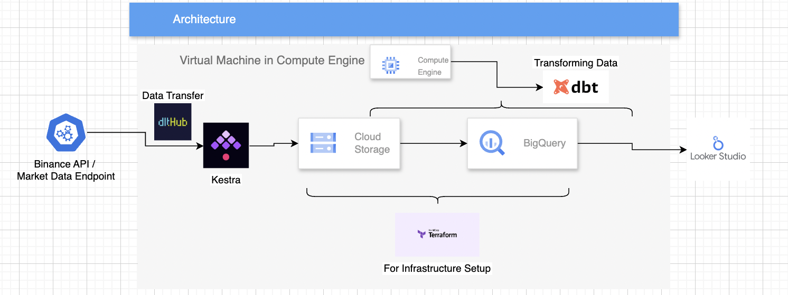

de_zoomcamp_2024_UCL_2016-2022

# The final project for DE Zoomcamp 2024

## Problem description:
While there is an abundance of data on Bitcoin prices available online, detailed representations of this data are less common. In this project, I used the Binance API – specifically the Market Data Endpoint – to retrieve in-depth information on the volume and number of trades between Bitcoin and USDT. This approach provides a more nuanced understanding of market behavior.

## Project Objective:
The primary objective of this project was to establish an end-to-end integration pipeline capable of collecting near real-time market data in a cloud-based environment that runs 24/7. Rather than relying on a local machine—which would require constant uptime and manual oversight—I chose to deploy the system on a Virtual Machine (VM) hosted on Google Cloud Platform (GCP).

By shifting to a cloud infrastructure, I ensured greater reliability, scalability, and long-term availability of the data collection process. The system was designed to be as autonomous as possible, with tasks automated to execute at regular 10-minute intervals. This eliminates the need for manual intervention and enables the pipeline to consistently capture up-to-date trading data. Ultimately, this setup provides a robust foundation for continuous data gathering and analysis, bringing us closer to a live market monitoring solution.

My personal goal was to practice skills on the data ingestion from an API Endpoint and making sure things run on a standard docker image (eventually one on Kestra). 

## Technologies
List of the tools used:

Compute Engine - to create a VM
Kestra - to build pipelines and trigger them contionuously
    Docker - created inside a Kestra task to run in a recreateable environment
    DLT - to get the data from Binance API and load to the GCS bucket
Terraform - to build GCP services
Google Cloud Storage - to store the data
Google BigQuery - to build the data tables/views for reporting 
Dbt cloud - to transform the data
Looker Data Studio - reporting

